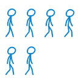
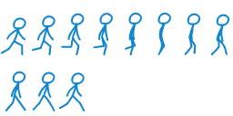
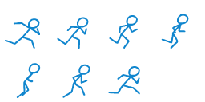

 

# Silksong Movement Tutorial - Part 1 | Project Moonstone #
[Godot Tutorial 2D - Programming Silksong Movement - Part 1](https://www.youtube.com/watch?v=lNePLabodBk) by [IcyEngine](https://icyengine.itch.io/) ([Discord](https://discord.com/invite/Ev9g6kBPnN))

This beginner-friendly tutorial guides viewers through building a 2D player controller inspired by the platforming movement of Hornet from Hollow Knight: Silksong. The project demonstrates how to structure and implement movement states, collision behavior, and input mapping within the Godot Engine using GDScript. By following along, you will create a robust, flexible, and expandable 2D platforming foundation that covers essential mechanics such as walking, falling, jumping, double jumping, floating, ledge climbing, and ledge jumping. It also served as the foundation for completing a structured implementation task on Feather, with the project integrated into the wider development workflow supporting the Handshake AI Project Moonstone initiative.

# Assets #
[Silksong Movement Tutorial Template Files](https://icyengine.itch.io/silksong-movement-tutorial) by [IcyEngine](https://icyengine.itch.io/) ([YouTube](https://www.youtube.com/@IcyEngine))

# Create a Godot task #
<ins> **Step 1: Context setting** </ins>
 
Please include the following context-setting data about the tutorial and segment you selected.

OS version: Windows 11 Pro

Application version: Godot Engine v4.6.1.stable.official [14d19694e]

<ins> Description of the task/project you selected </ins>
 
Inspired by Hollow Knight: Silksong's gameplay, the selected project will implement Hornet's platforming mechanics, focusing on programming the basic movement and controls of a pixel-art character in the Godot Engine. This tutorial covers setting up the project and keybinds, implementing a state machine, and programming moves such as falling, walking, jumping, double jumping, floating, ledge climbing, and ledge jumping. This task will follow a YouTube video tutorial titled "Godot Tutorial 2D - Programming Silksong Movement - Part 1" created by IcyEngine, using the time segment from approximately 00:49 to 22:24.

- Start Point: https://youtu.be/lNePLabodBk?si=gugDO2DURNJEcp2t&t=49
- End Point: https://youtu.be/lNePLabodBk?si=-RUTf52q6qv5uI3X&t=1344

In this segment, the video tutorial demonstrates a systematic process for programming the 2D platformer movement and mechanics from Hollow Knight: Silksong in the Godot Engine. It covers setting up the project with a character sprite and essential nodes, configuring keybinds, and building a robust state machine to manage various player actions. The video tutorial meticulously breaks down each movement, showing how to implement physics, animations, and state transitions. The core of the development focuses on implementing distinct movement states, such as falling under gravity, walking, single jumping, double jumping, controlled floating, ledge climbing, and canceling ledge climbs. Each step builds on the previous one, progressively introducing new constants, variables, and functions to form a cohesive, scalable character controller that recreates Hornet's platforming movement.

<ins> Briefly describe the inputs to / input state of this project. </ins>
 
The input state consists of a newly created Godot Engine project initialized using the template files from the Tutorial Ready Template pack created by IcyEngine on itch.io. The project begins by extracting the assets folder from the tutorial_ready_template.zip file, which provides the foundational resources and structure needed to start the implementation. This project includes a preconfigured assets folder containing a functional test level, a structured node hierarchy, a starter player controller, and an original blue stick figure sprite asset. This template controller utilizes a CharacterBody2D root node, a CollisionShape2D node configured with a capsule shape for the sprite, a Camera2D node that follows the player character during movement, and an AnimatedSprite2D node containing multiple animation frames. https://icyengine.itch.io/silksong-movement-tutorial

<ins> **Step 2: Task completion** </ins>
 
Screen recordings and intermediate artifacts.

<ins> Brief description of the breakpoint-1 </ins>
 
Starting with the YouTube video tutorial, I created a new Godot project named "Silksong Movement Tutorial," and uploaded the "assets" folder from the Tutorial Ready Template pack to the "res://" folder in Godot and navigated to the "scenes" folder, then to the "levels" folder, and clicked on the "pixel_level.tscn" file to load the first scene with the sprite asset. I then opened "Project Settings" from the "Project" menu in the top-left corner, navigated to the "Input Map" tab, and created new actions named "move_left," "move_right," "jump," and "sprint," assigning them to the A and D keys, the Space bar, and the Shift key to configure player movement controls. I then opened the player controller script to program the state machine, where I defined an enum to represent the player's movement states, created a variable to track the active state, and wrote functions to switch between states and process their behavior during physics updates so the character's movement logic could get organized and expanded cleanly.

<ins> Brief description of the breakpoint-2 </ins>
 
Continuing with the YouTube video tutorial, I refined the state machine logic in the GDScript by implementing behavior for both the "FALL" and "FLOOR" states. First, I right-clicked the "AnimatedSprite" child node, enabled "Access as Unique Name" from the drop-down menu, and then dragged the node into the script while holding the Ctrl key to create the reference. For the "FALL" state, I updated the script to apply gravity on each physics frame, allowing the player's downward velocity to increase naturally until it reaches a defined limit, while still permitting horizontal movement based on player input. I introduced constants such as "FALL_GRAVITY," "FALL_VELOCITY," and "WALK_VELOCITY" to organize and adjust movement values in the script. I also created a reusable "handle_movement" function to process horizontal input, apply left–right velocity, and flip the sprite direction, ensuring consistent movement logic across states. During the "FALL" state, gravity is applied to the player's vertical velocity while executing the "handle_movement" function, allowing the player to retain horizontal control while airborne. For the "FLOOR" state, I implemented logic to handle idle standing, walking, and transitions between grounded and airborne behavior using Godot's built-in floor detection. I configured the script to trigger the appropriate animations depending on whether movement input is present, switching between idle and walk animations while reusing the same "handle_movement" function for horizontal motion. I also established the core state transitions: the player switches to the "FALL" state when no longer on the floor and returns to the "FLOOR" state upon landing, ensuring responsive movement within the Godot physics system.

<ins> Brief description of the breakpoint-3 </ins>
 
Following the YouTube video tutorial, I added a variable-height jump mechanic in Godot, where the duration of the jump input determines the player character's jump height. The player character reaches maximum jump height when holding the Space key, but releasing it early cuts the jump short, which causes the player character to descend immediately. To support this behavior, I added a "Timer" node named "CoyoteTimer" as a child of the "PlayerController" node to provide a short grace period that still allows jumping shortly after leaving a platform. Inside the timer's settings, I changed the "Process Callback" to "Physics," set the "Wait Time" to 0.2 seconds to define the grace window, enabled "One Shot," and then right-clicked the "CoyoteTimer" node, enabled "Access as Unique Name" from the drop-down menu, and dragged it into the script to create a direct reference. In the GDScript, I added a constant named "JUMP_VELOCITY" with a value of -600.0 to define the initial upward force and another constant named "JUMP_DECELERATION" with a value of 1500.0 to control how quickly upward motion slows when the jump input is released. When entering the jump state, I start the jump animation, set the Y velocity, and stop the coyote timer, which is triggered when transitioning from the "FLOOR" state to the "FALL" state. Inside the "process_state" function, I define the jump behavior by gradually reducing the upward velocity toward zero while still allowing horizontal control through the "handle_movement" function. I also added logic to transition into the "FALL" state either when the jump button is released or when the vertical velocity becomes positive, ensuring a natural arc. Finally, I enabled transitions to the "JUMP" state from the "FLOOR" state when pressing the Space key, and enabled transitions to the "JUMP" state from the "FALL" state when pressing the Space key briefly after walking off any ledge in the level.

<ins> Brief description of the breakpoint-4 </ins>
 
Working with the YouTube video tutorial, I implemented the "DOUBLE_JUMP" state by defining a constant named "DOUBLE_JUMP_VELOCITY" with a value of -450.0 to control the upward force, and by introducing a boolean variable called "can_double_jump," initialized to false, to track whether the ability is available while airborne. When entering the "DOUBLE_JUMP" state, the script plays the "double_jump" animation, applies the upward motion by setting the player's Y velocity to "DOUBLE_JUMP_VELOCITY," and immediately sets the "can_double_jump" variable to false to prevent repeated jumps. Horizontal movement remains responsive during this state, allowing the player to retain full control while airborne. To prevent the animation from being overridden too quickly, I modified the "FALL" state so the standard fall animation plays when the previous state was not a double jump. The ability gets restored by resetting the "can_double_jump" variable to true when the player lands, with its movement logic integrated into the existing jump system rather than implemented as a separate state script. Finally, when pressing the jump button while airborne, the script first checks whether it can trigger a coyote time jump; if not, it then checks whether "can_double_jump" is true and, if so, transitions to the "DOUBLE_JUMP" state, allowing the player to jump a second time by pressing the Space key again.

<ins> Brief description of the breakpoint-5 </ins>
 
To implement the "FLOAT" state in my Godot project, inspired by the "Drifter's Cloak" in Silksong, which allows the Hornet to hover by pressing and holding the jump button while falling. To set this up, I first added a "FloatCooldown" Timer node as a child of the "PlayerController" node, changed the "Process Callback" to "Physics," set the "Wait Time" to 0.1 seconds, enabled "One Shot," and then right-clicked the "FloatCooldown" node, enabled "Access as Unique Name" from the drop-down menu, and dragged it into the script. I also introduced two new constants: "FLOAT_GRAVITY" with a value of 200.0 and "FLOAT_VELOCITY" with a value of 100.0, which control the upward force and reduced gravity while floating. Upon entering the float state, the script checks the "FloatCooldown" timer; if active, it reverts to the previous state to prevent an invalid float. If not on cooldown, the float animation plays, and the player's Y velocity is set to zero, allowing the character to hover in place. The "FLOAT" state mirrors the "FALL" state's motion handling, but uses "FLOAT_GRAVITY" and "FLOAT_VELOCITY" constants to produce a slower descent while maintaining horizontal control. To exit the "FLOAT" state, the player transitions back to the "FALL" state when the jump button is released, which also triggers the "FloatCooldown" Timer to prevent immediate reuse. By nesting the float transition within an "else" statement following the coyote timer and double-jump checks, the script prioritizes those actions. This logic prevents the shared input from triggering a float prematurely while the player is in the "FALL" state.

<ins> Brief description of the breakpoint-6 </ins>
 
To implement the "LEDGE_CLIMB" state in my Godot project, I began by setting up crucial components in the "PlayerController" scene. This process involved adding a "RayCast2D" node named "LedgeClimbRayCast," positioned diagonally in front of the player for precise ledge detection, and another "RayCast2D" node called "LedgeSpaceRayCast," placed next to the player and pointing upward to verify clear space for climbing, making it slightly taller than the collider. Both "RayCast2D" nodes and the "PlayerCollider" node were set to "Access as Unique Name" in the drop-down menu, then dragged into the script, and then I introduced a "facing_direction" variable initialized to 1.0. In the "_ready" function, I configured the "LedgeClimbRayCast" to ignore the player's own collision shape to prevent self-detection issues. Upon entering the "LEDGE_CLIMB" state, the script automatically activates the "ledge_climb" animation, sets the player's velocity to zero, precisely aligns the player's Y position with the detected ledge's collision point, and resets the "can_double_jump" variable to true. I updated the "handle_movement" function to dynamically adjust the "facing_direction" based on player input and correctly update each "RayCast2D" node's X position and target position, forcing a refresh to keep the collision data current during gameplay.

<ins> Brief description of the breakpoint-7 </ins>
 
Furthermore, I implemented four essential helper functions: "is_input_toward_facing" to verify that the player is moving in the facing direction, "is_ledge" to confirm valid ledge conditions by checking "is_on_wall_only," the "LedgeClimbRayCast" collision, and that the surface normal points upward, "is_space" to ensure there is enough room above the ledge by repositioning and updating the "LedgeSpaceRayCast," and "ledge_climb_offset" to perfectly snap the player to the ledge top using the collision shape's size. In the "process_state" function for the "LEDGE_CLIMB" state, when the animation completes and the idle animation starts, the player's position adjusts using a calculated offset, and the state transitions smoothly to the "FLOOR" state. Furthermore, I developed four essential helper functions: "is_input_toward_facing" to confirm input direction, "is_ledge" to validate ledge conditions, "is_space" to verify clear space above the ledge by repositioning and updating LedgeSpaceRayCast, and "ledge_climb_offset" to perfectly snap the player to the ledge top using the collision shape's size. Within the "process_state" function for the "LEDGE_CLIMB" state, once the animation concludes and the idle animation begins, the player's position updates with a calculated offset, and the state seamlessly transitions to the "FLOOR" state. Finally, transitions into the "LEDGE_CLIMB" state are enabled from both the "FALL" and "FLOAT" states, triggered by an "elif" condition that checks for input toward the facing direction, confirms a valid ledge, and verifies there is enough space to complete the climb.

<ins> Brief description of the breakpoint-8 </ins>
 
Finishing with the YouTube video tutorial, I implemented the "LEDGE_JUMP" state, which involved defining a constant named "LEDGE_JUMP_VELOCITY" with a value of -500.0, which controls the upward force when the user presses the jump button. When the player enters the "LEDGE_JUMP" state, the script reuses the "double_jump" animation for visual effect and sets the player's Y velocity to "LEDGE_JUMP_VELOCITY." Similar to the "DOUBLE_JUMP" state, its logic gets incorporated into the "process_state" function as a condition alongside the normal "JUMP" state. The primary transition into this state starts from the "LEDGE_CLIMB" state, activated by an "elif" statement that checks when the player presses the jump button. If a jump cancel occurs, the "progress" variable shows how far the player is in the climb animation. The "progress" value scales the "ledge_climb_offset" horizontal value to determine the player's jump distance from the ledge, and then the state transitions to "LEDGE_JUMP" rather than reverting to "FLOOR." Having completed a robust animated character controller with horizontal walking, falling, single jumping, double jumping, floating, ledge climbing, and ledge jumping, the next part of this project will introduce additional special moves, including wall sliding, wall jumping, wall climbing, sprinting, and dashing.

<ins> **Step 3: Task specification** </ins>
 
Prompt reference file(s).

<ins> Reference link/description </ins>
 
Godot Tutorial 2D - Programming Silksong Movement - Part 1 by [IcyEngine](https://www.youtube.com/@IcyEngine): https://www.youtube.com/watch?v=lNePLabodBk

<ins> Reference link/description </ins>
 
Silksong Movement Tutorial Files from the Tutorial Ready Template by [IcyEngine](https://itch.io/profile/icyengine): https://icyengine.itch.io/silksong-movement-tutorial

<ins> Final Prompt </ins>
 
In the Godot Engine, create a playable 2D game with a resolution of 1152 × 648 pixels, featuring a controllable player character using a pixel-art sprite asset. The scene should have a solid background color of #4d4d4d, and the player sprite should display sharply, preserving pixel detail, using the "Nearest" texture filter. The player character is a blue sticker figure that can walk, jump, double jump, fall, float, climb ledges, and perform ledge jumps. All movement behaviors use constants defined in the script that are unchangeable at runtime, but can be adjusted in the code to fine-tune gameplay balance. These distinct constants include "FALL_GRAVITY" to control the gravity while falling, "FALL_VELOCITY" to control the falling speed, "WALK_VELOCITY" to control the walking speed, "JUMP_VELOCITY" to control the initial jump force, "JUMP_DECELERATION" to control the jump speed slowdown, "DOUBLE_JUMP_VELOCITY" to control the double jump speed, "FLOAT_GRAVITY" to control the gravity while slowly floating down, "FLOAT_VELOCITY" to control the vertical floating speed, and "LEDGE_JUMP_VELOCITY" to control the ledge jump speed.

The physics is configured with a gravity value of 980 pixels per second squared, ensuring that the player character responds naturally to falls and jumps in the game environment. The Input Map defines custom input actions to control the player character, with "move_left" bound to the A key for leftward movement, "move_right" bound to the D key for rightward movement, "jump" bound to the Space key for jumping, and "sprint" bound to the Shift key for sprinting. Player movement responds to input as follows: the A key moves the player left, the D key moves the player right, pressing the Space key once performs a normal single jump, pressing it twice performs a double jump, and pressing it a third time, holding the key, causes the player to float and descend slowly. Pressing and holding the Space key causes the player character to jump higher, and releasing all input keys immediately stops player movement during gameplay. The movement functionally allows the player character to briefly jump after walking off a ledge, commonly known as coyote time, and imposes a cooldown that limits how frequently the player can float. The floating mechanic grants the player character the ability to pause and hover while airborne, and to repeat this action for precise midair control and maneuverability. 

The player controller incorporates ledge detection to identify climbable surfaces and confirm that adequate open space exists above or behind the player character to allow safe movement. If the required gameplay conditions have been satisfied, the character can automatically climb over the ledge or quickly press the Space key during the ledge climb to perform a ledge jump without colliding with surrounding geometry. The specific method for detecting ledges is flexible, but the climbing and ledge-jumping behavior must work correctly with the state machine and be clearly observable during gameplay. The player character must include properly configured body collision to ensure consistent interaction with the level environment, so the character remains supported by platforms, stops against walls, and does not pass through or fall through solid terrain during gameplay. The game camera must ensure the player character remains consistently visible on-screen within the viewport as the player moves, preventing unintended off-screen positioning and maintaining continuous visibility throughout gameplay. A state machine implemented in the script controls transitions between movement states, including falling, walking, jumping, double jumping, floating, ledge climbing, and ledge jumping. Each movement state responds correctly to the defined constants, timers, raycasts, and input actions, ensuring consistent behavior while allowing the gameplay to be easily tuned and adjusted.

<ins> Rubric Items </ins>
 
1. The project's viewport width value is 1152. 
- Confirm that the Viewport Width value is equal to 1152 by navigating to "Project Settings," then "Display," and then "Window."
- The prompt requires the project's resolution to be 1152 x 648, and because these values are adjustable individually, each should receive partial credit.

2. The project's viewpoint height value is 648.
- Confirm that the Viewport Height value is equal to 648 by navigating to "Project Settings," then "Display," and then "Window."
- The prompt requires the project's resolution to be 1152 x 648, and because these values are adjustable individually, each should receive partial credit.

3. The scene's background color is filled with the color #4d4d4d.
- Verify that the Default Clear Color hex value is #4d4d4d by clicking on "Project Settings," then "Rendering," and then "Environment."
- The prompt requires the scene background to use a dark gray color appropriate to the environment.

4. The project's physics gravity value is 980 pixels/s^2.
- Confirm that the Default Gravity value is equal to 980.0 px/s^2 by clicking on "Project Settings," then "Physics," and then "2D."
- The prompt requires that the project environment use a physics gravity of exactly 980.0 pixels per second squared.

5. The project's default texture filter is assigned to nearest.
- Confirm that the Default Texture Filter is assigned to "Nearest" by clicking on "Project Settings," then "Rendering," and then "Textures."
- The prompt requires that the sprite asset display a clearly visible pixel-art texture with crisp edges and preserved detail.

6. The Input Map includes a "move_left" action bound to the A key.
- Confirm an input action exists with the A key by navigating to "Project Settings" and then to "Input Map" to see the "Action" list.
- The prompt requires that pressing the A key should cause the player character to move left.

7. The Input Map includes a "move_right" action bound to the D key.
- Confirm an input action exists with the D key by navigating to "Project Settings" and then to "Input Map" to see the "Action" list.
- The prompt requires that pressing the D key should cause the player character to move right.

8. The Input Map includes a "jump" action bound to the Space key.
- Confirm an input action exists with the Space key by navigating to "Project Settings" and then to "Input Map" to see the "Action" list.
- The prompt requires that the Space key be assigned as a keyboard input action to make the player character jump.

9. The Input Map includes a "sprint" action bound to the Shift key.
- Confirm an input action exists with the Shift key by navigating to "Project Settings" and then to "Input Map" to see the "Action" list.
- The prompt requires that the Shift key be assigned as a keyboard input action to make the player character sprint.

10. Pressing the A key moves the player character to the left.
- Run the main scene and press the A key to observe the sprite asset perform leftward movement.
- Pressing the A key should cause the sprite asset to move left, as required by the prompt.

11. Pressing the D key moves the player character to the right.
- Run the main scene and press the D key to observe the sprite asset perform rightward movement.
- Pressing the D key should cause the sprite asset to move right, as required by the prompt.

12. Pressing the Space key makes the player character jump up.
- Run the main scene and press the Space key to observe the sprite asset jump upward.
- Pressing the Space key should cause the sprite asset to jump up, as required by the prompt.

13. Pressing the Space key twice makes the player character double jump.
- Run the main scene and press the Space key twice to observe the sprite asset jump twice.
- Pressing the Space key twice should cause the sprite asset to double jump, as required by the mechanic in the prompt.

14. Pressing the Space key thrice makes the player character float down.
- Run the main scene and press the jump key three times, holding it down on the third press to make the player character float down.
- The prompt requires that pressing the Space key three times and holding it on the third press should cause the player to float down.

15. Holding the Space key makes the player jump higher than tapping it.
- Run the main scene, quickly tap the Space key for a normal jump, and then press and hold the Space key for a high jump.
- Pressing and holding down the Space key should cause the sprite asset to jump up higher, as required by the mechanic in the prompt.

16. The player character can climb over any ledge when in close contact.
- Run the main scene, move close to any ledge in the level, and observe the player character automatically perform a ledge climb.
- The player character should automatically climb over any ledge when the game detects it as climbable, as required by the prompt.

17. Pressing the Space key during the ledge climb executes a ledge jump.
- Run the main scene, quickly press the Space key during a ledge climb, and observe the player character perform a ledge jump.
- The player character should jump over any ledge when pressing the Space key during the ledge climb, as required by the prompt.

18. The player character stops moving when any input key is released.
- Run the main scene, press any input action key, then release the action key, and observe whether movement ceases instantly.
- The prompt requires that the player character stop moving immediately when any pressed input action key is released.

19. The player character can briefly jump right after walking off any ledge.
- Run the main scene, walk off any platform, then quickly press the Space key to perform a jump right after leaving the ledge.
- The prompt requires that the player character have a coyote timer to allow players to jump fairly immediately after walking off a ledge.

20. The player character can repeatedly pause and float while airborne.
- Run the main scene, double jump off a high platform, and while in midair, repeatedly press and hold the Space key to float continually.
- The prompt requires that the player character can pause and float multiple times while airborne to use the cooldown time functionality.

21. The player character properly collides with the level environment.
- Run the main scene and move the player across platforms and into walls, confirming the character does not pass through solid terrain.
- The prompt requires that the player character have a functional body collision to interact correctly with the level environment.

22. The player character remains consistently visible in the camera view.
- Run the main scene and move the player character across the level to confirm that the sprite remains within the visible camera view.
- The prompt requires the player character to remain consistently framed and visible to ensure continuous gameplay.

23. The player character correctly transitions between movement states.
- Run the main scene and observe the player character as it falls, walks, jumps, double-jumps, floats, ledge-climbs, and ledge-jumps.
- The prompt requires a functioning state machine that manages the player character's movement between all movement states.

24. A "FALL_GRAVITY" constant controls the player's gravity while falling.
- Inspect the GDScript code for an unchangeable constant named "FALL_GRAVITY" affecting the falling gravity of the player character.
- The prompt requires the GDScript code to define falling gravity as an unchangeable constant, but configurable for movement balance.

25. A "FALL_VELOCITY" constant controls the player's falling speed.
- Inspect the GDScript code for an unchangeable constant named "FALL_VELOCITY" affecting the fall speed of the player character.
- The prompt requires the GDScript code to define falling velocity as an unchangeable constant, but configurable for movement balance.

26. A "WALK_VELOCITY" constant controls the player's walking speed.
- Inspect the GDScript code for an unchangeable constant named "WALK_VELOCITY" affecting the walk speed of the player character.
- The prompt requires the GDScript code to define walk velocity as an unchangeable constant, but configurable for movement balance.

27. A "JUMP_VELOCITY" constant controls the player's initial jump force.
- Inspect the GDScript code for an unchangeable constant named "JUMP_VELOCITY" affecting the jump speed of the player character.
- The prompt requires the GDScript code to define jump velocity as an unchangeable constant, but configurable for movement balance.

28. A "JUMP_DECELERATION" constant controls the jump slowdown rate.
- Inspect the GDScript code for an unchangeable constant named "JUMP_DECELERATION" affecting the jump slowdown of the player.
- The prompt requires the GDScript code to define jump deceleration as an unchangeable constant, but configurable for jumping control.

29. A "DOUBLE_JUMP_VELOCITY" constant controls double jump force.
- Inspect the GDScript code for an unchangeable constant named "DOUBLE_JUMP_VELOCITY" affecting the double jump speed.
- The prompt requires the GDScript code to define the double jump velocity as an unchangeable constant, but configurable for jumping.

30. A "FLOAT_GRAVITY" constant controls the player's floating gravity.
- Inspect the GDScript code for an unchangeable constant named "FLOAT_GRAVITY" affecting the float gravity of the player character.
- The prompt requires the GDScript code to define the float gravity as an unchangeable constant, but configurable for movement balance.

31. A "FLOAT_VELOCITY" constant controls vertical speed while floating.
- Inspect the GDScript code for an unchangeable constant named "FLOAT_VELOCITY" affecting the floating speed of the player.
- The prompt requires the GDScript code to define float velocity as an unchangeable constant, but configurable for movement balance.

32. A "LEDGE_JUMP_VELOCITY" constant controls the ledge jump force.
- Inspect the GDScript code for an unchangeable constant named "LEDGE_JUMP_VELOCITY" affecting the player's ledge jump speed.
- The prompt requires the GDScript code to define the ledge jump velocity as an unchangeable constant, but configurable for jumping.

---

# Silksong Movement Tutorial - Part 1 | Project Touchstone #
[Godot Tutorial 2D - Programming Silksong Movement - Part 1](https://www.youtube.com/watch?v=lNePLabodBk) by [IcyEngine](https://icyengine.itch.io/) ([Discord](https://discord.com/invite/Ev9g6kBPnN))

This beginner-friendly tutorial guides viewers through building a 2D player controller inspired by the platforming movement of Hornet from Hollow Knight: Silksong. The project demonstrates how to structure and implement movement states, collision behavior, and input mapping within the Godot Engine using GDScript. By following along, you will create a robust, flexible, and expandable 2D platforming foundation that covers essential mechanics such as walking, falling, jumping, double jumping, floating, ledge climbing, and ledge jumping. It also served as the foundation for completing a structured implementation task on Feather, with the project integrated into the wider development workflow supporting the Handshake AI Project Moonstone initiative.

# Assets #
[Silksong Movement Tutorial Template Files](https://icyengine.itch.io/silksong-movement-tutorial) by [IcyEngine](https://icyengine.itch.io/) ([YouTube](https://www.youtube.com/@IcyEngine))

# Create a Godot task #
<ins> What application is this task for? </ins>
 
Godot

### **Task prompt** ###
First, enter the **task prompt** and any relevant reference files (e.g., docs, diagrams, sketches, photos, schematics).

Tasks should sound like what a manager might give a skilled but junior employee: high-level guidance with some leeway on executional details, but with very clear success metrics. What a good outcome looks like must be very clear and easy to understand.

Include any relevant **reference files** (docs, diagrams, sketches, photos, schematics, etc.) needed for someone to do this task.

Reminder on the difference between reference and starting state files:
- **Reference files**: anything the Employee should look at or read while completing the project that does not need to be directly loaded into the application (*'please make something that looks like XYZ image'*)
- **Starting state files (upload below)**: anything that the Employee would need to load into their workspace to complete the task (*'here is the existing file you should adapt'*)

<ins> Task prompt (ask the Employee) </ins>
 
We are beginning development of the movement system for our 2D pixel-art platformer prototype game. The starting build consists of a functional level environment featuring green and brown textures, an original blue stick-figure player character sprite, and properly configured collision bodies for both the level environment and the player character. It also includes all animation frames for the player character's various movement actions, a camera node to ensure consistent gameplay display, and other necessary nodes to ensure the build runs correctly. Your task is to build upon this starting foundation by implementing a functional player controller, core movement mechanics, and a foundational state machine inspired by Hornet's movement style from Hollow Knight: Silksong. The system should enable responsive, fluid platforming by carefully configuring physics behavior and control inputs while preserving the visual clarity expected in a pixel-art platformer.

The scene background should use a dark gray color appropriate for a simple testing environment, and the project should apply design settings that preserve the crisp visual appearance of all pixel-art assets. The player character should be controllable using standard keyboard inputs: A to move left, D to move right, and the Space key to jump. Implement the movement controller to support basic platforming mechanics, enabling the player character to interact dynamically with the level environment. The system must include properly configured gravity physics that produce a natural, consistent downward pull during gameplay and ensure the player character visually faces the correct direction as it moves. Overall, the movement system should establish a responsive and reliable foundation for platforming, aligning physics behavior, player input, and visual feedback to support a polished gameplay experience. The new movement system should include the following movement abilities:

- Horizontal movement allows the player character to walk left.
- Horizontal movement allows the player character to walk right.
- A single jump enables the player character to ascend upward.
- A double jump provides an additional midair boost to extend reach.
- A variable jump height provides better control over jump height.
- Floating to descend and make more precise landings smoothly.
- Midair floating allows multiple pauses for extended air control.
- Ledge climbing enables smooth movement over platform edges.
- A brief grace period allows jumping shortly after leaving a platform.
- A ledge jump enables upward movement while climbing a ledge.

The player character should stop moving when movement input is released, retain the ability to jump briefly after stepping off a platform, and be able to activate floating multiple times while airborne according to the intended cooldown behavior. The movement system must also incorporate new jump mechanics that enhance player control during traversal, since jumping will be the most-used action for getting across the level. Pressing the Space key once makes the player character jump, pressing it a second time in midair triggers a double jump, and pressing it a third time while holding it enables slow floating. The jump system should support variable jump height, allowing the character to reach greater heights when the Space key is held down rather than tapped quickly. Furthermore, the player controller must interact properly with the level environment by colliding with platforms and walls, ensuring the character cannot pass through solid terrain. When the character approaches a climbable ledge, defined as being close to an edge without any obstruction, the system should automatically allow them to climb over it upon close contact.

During the ledge-climbing action, pressing the Space key will enable the player character to perform a ledge jump, propelling them upward from the ledge. The player character must remain visible and tracked in the camera view throughout gameplay to ensure a consistent on-screen experience. The movement should feel responsive, fluid, and coherent during gameplay, avoiding stickiness or input lag while ensuring smooth transitions between actions. The player character should transition smoothly between movement states, including walking, jumping, double jumping, falling, floating, and ledge traversal. Once implemented, the player character should be able to navigate the given platforming test environment, demonstrating that all advanced movement mechanics work together seamlessly. Additionally, the design must be modular to facilitate adding new abilities and gameplay features in future development without necessitating major architectural changes.

<ins> Which of the following best fits this task? </ins>
 
Additional work on an existing very large project

<ins> How long would you anticipate this task taking an 'Employee' to complete? (in hours) </ins>
 
1

### **Starting state** ###
Please describe and include below any information about the starting state of this project:
- Existing work to be modified
- Other assets or other inputs the Employee needs to bring to be able to complete this task

Reminder on the difference between the starting state and the reference files:
- **Starting state files**: anything that the Employee would need to load into their workspace to complete the task ('*here is the existing file you should adapt*')
- **Reference files (upload above)**: anything the Employee should look at or read while completing the project that does not need to be directly loaded into the application ('*please make something that looks like XYZ image*')

<ins> Starting state description </ins>
 
The starting state for this task is a preconfigured Godot Engine project layout that provides a foundational framework for a 2D platformer. It includes a structured project setup with organized folders for assets, scenes, scripts, and resources, as well as a functional test level featuring green and brown textures to evaluate player movement and interactions. The player character is represented by a blue stick-figure sprite set, with individual animation frames for actions such as idle, walking, running, jumping, double jumping, floating, ledge climbing, and ledge jumping. These assets not only provide visual support for validating movement in the environment but also serve as a foundation for assigning and testing keybindings, ensuring that each input corresponds accurately to the intended animation and action. When running the starting state, the project only displays the level and spawns the player character with its collision body, but movement and other gameplay mechanics remain inactive. The current player controller script and scene need modification and expansion to implement the basic movement systems effectively, which requires familiarity with GDScript programming, node composition, and the ability to maintain an extensible architecture.

### **Overall context** ###
Finally, include context on this task and why it is realistic and representative of real-life work:
- Why is this a reasonable task for a manager to ask a junior-level employee to do?
- Is there a larger project it might be a part of?

<ins> Task context </ins>
 
This task represents a realistic and appropriate assignment for a junior-level developer because it focuses on implementing foundational gameplay systems within an existing project structure rather than building systems from scratch. It requires applying core skills such as scripting in GDScript, working with node-based architectures, handling player input, and configuring physics behavior, which are common responsibilities for entry-level game developers. The scope is well-defined, with clear requirements for movement mechanics and expected outcomes, allowing the employee to focus on execution, debugging, and refinement while reinforcing best practices in modular design and clean code organization. Additionally, this task mirrors real-world development workflows, in which junior developers are often responsible for extending existing systems, integrating assets, and implementing gameplay features in accordance with design specifications. It also encourages problem-solving and iteration, particularly in achieving responsive, fluid movement, a critical aspect of game feel in platformers. This work would typically be part of a larger game development project, specifically within the early prototyping or vertical slice phase. Establishing a solid, extensible movement system is a key milestone, as it lays the foundation for future mechanics, including combat, enemy interactions, level design, and player abilities. By completing this task, the employee contributes directly to building a scalable gameplay framework that can support continued development and feature expansion.

<ins> Rubric Items </ins>
 
1. The background color of the project environment is dark gray.
- Run the main scene and observe that the environment's background color remains a consistent dark gray throughout the entire level.
- The prompt requires a level background in dark gray, ensuring the color remains consistent with and appropriate for the environment.

2. The gravity physics produces a natural and consistent downward pull.
- Run the main scene and observe the player character falling to confirm that gravity causes a natural downward acceleration.
- The prompt requires that the environment's gravity produce realistic falling behavior and a consistent downward pull for entities.

3. The blue stick figure pixel sprite appears sharp during gameplay.
- Run the main scene and observe the player character sprite to confirm that the blue stick figure appears sharp and crisp.
- The prompt requires that the blue stick-figure character sprite remain sharp and clearly visible throughout gameplay.

4. The terrain environment pixel sprite appears sharp during gameplay.
- Run the main scene and observe the level environment to confirm that the green and brown textures appear sharp and crisp.
- The prompt requires that the terrain level environment sprite remain sharp and clearly visible throughout gameplay.

5. The action animation frames for the player character all run smoothly.
- Run the main scene and observe the player character performing different actions to confirm that all animation frames play smoothly.
- The prompt requires that each animation for movement actions flow seamlessly and have consistent timing with no visible stuttering.

6. The player character can move left when pressing the A key.
- Run the main scene, press the A key on your keyboard, and observe that the player character moves left across the level environment.
- The prompt requires that the A key be assigned as a keyboard input to move the player character leftward during gameplay.

7. The player character can move right when pressing the D key.
- Run the main scene, press the D key on your keyboard, and observe that the player character moves right across the level environment.
- The prompt requires that the D key be assigned as a keyboard input to move the player character to the right during gameplay.

8. The player character can jump upward when pressing the Space key.
- Run the main scene, press the Space key on your keyboard, and observe that the player character jumps up in the level environment.
- The prompt requires assigning the Space key as a keyboard input action to make the player character jump during gameplay.

9. The player double jumps when pressing the Space key twice.
- Run the main scene, jump and press the Space key while airborne, and observe that the player character double jumps in the level.
- The prompt requires that pressing the Space key twice while airborne causes the player character to double-jump.

10. The player character can jump higher when holding the Space key.
- Run the main scene, quickly tap the Space key for a normal jump, and then press and hold the Space key for a high jump.
- The prompt requires that pressing and holding the Space key should cause the player character to perform a high jump.

11. The player character can float downward smoothly while airborne.
- Run the main scene, double jump off a platform, and press and hold the Space key to confirm that the character can float downward.
- The prompt requires that pressing the Space key three times, holding it on the third press, should cause the player to float down.

12. The player character can repeatedly pause and float while airborne.
- Run the main scene, double jump off a high platform, and while in midair, repeatedly press and hold the Space key to float continually.
- The prompt requires that the player character can pause and float multiple times while airborne to use the cooldown time functionality.

13. The player character can climb over any ledge when in close contact.
- Run the main scene, move close to any ledge in the level, and observe the player character automatically perform a ledge climb.
- The prompt requires that the player character can automatically climb over any ledge when the game detects it as climbable.

14. The player character can briefly jump right after leaving any ledge.
- Run the main scene, walk off any platform, then quickly press the Space key to perform a jump right after leaving the ledge.
- The prompt requires the player character to have a short window to briefly jump after losing contact with a ledge.

15. The player character can ledge jump when climbing over any ledge.
- Run the main scene, quickly press the Space key during a ledge climb, and observe the player character perform a ledge jump.
- The prompt requires that the player character can jump over any ledge when pressing the Space key during the ledge climb.

16. The player character stops moving when any input key is released.
- Run the main scene, press any input action key, then release the action key, and observe whether movement ceases instantly.
- The prompt requires that the player character stop moving immediately when any pressed input action key is released.

17. The player character properly collides with the level environment.
- Run the main scene and move the player across platforms and into walls, confirming the character does not pass through solid terrain.
- The prompt requires the player character to have a functional body collision to interact accurately with the level environment.

18. The player character correctly transitions between movement states.
- Run the main scene and observe the player character as it falls, walks, jumps, double-jumps, floats, ledge-climbs, and ledge-jumps.
- The prompt requires a functioning state machine that manages the player character's movement between all movement states.

19. The player character faces the correct direction during movement.
- Run the main scene, press the A and D keys to move left and right, and confirm that the player character faces the movement direction.
- The prompt requires that the player character visually face the direction of motion to reflect accurate orientation during gameplay.

20. The camera follows the player character smoothly during gameplay.
- Run the main scene and move the player character across the level to confirm that the game camera smoothly tracks the player.
- The prompt requires smooth camera tracking to maintain a stable and consistent view of the player character throughout gameplay.
 
Godot - https://feather.openai.com/tasks/9a1bbcdb-9924-411f-b871-9938ee7ca897/stage/prompt_creation - Awaiting response.

---

# Silksong Movement Tutorial - Part 2 | Project Touchstone #
[Godot Tutorial 2D - Programming Silksong Movement - Part 2](https://www.youtube.com/watch?v=yv9J5N4FeDY) by [IcyEngine](https://icyengine.itch.io/) ([Discord](https://discord.com/invite/Ev9g6kBPnN))

This tutorial guides viewers through building an advanced 2D player controller in the Godot Engine, inspired by the platforming movement of Hornet from Hollow Knight: Silksong. As a follow-up project, this video demonstrates how to implement complex mechanics, including wall sliding, wall jumping, wall climbing, dashing, sprinting, and an updated float state. It covers structuring movement states, handling collision and timer behavior with different nodes, setting up input actions, and writing robust GDScript code to create a flexible, expandable, and responsive platforming experience. It also served as the foundation for a structured implementation task on Feather, with the project integrated into the broader development workflow supporting the Handshake AI Project Touchstone initiative.

# Assets #
[Silksong Movement Tutorial Template Files](https://icyengine.itch.io/silksong-movement-tutorial) by [IcyEngine](https://icyengine.itch.io/) ([YouTube](https://www.youtube.com/@IcyEngine))

# Create a Godot task #
<ins> What application is this task for? </ins>
 
Godot

### **Task prompt** ###
First, enter the **task prompt** and any relevant reference files (e.g., docs, diagrams, sketches, photos, schematics).

Tasks should sound like what a manager might give a skilled but junior employee: high-level guidance with some leeway on executional details, but with very clear success metrics. What a good outcome looks like must be very clear and easy to understand.

Include any relevant **reference files** (docs, diagrams, sketches, photos, schematics, etc.) needed for someone to do this task.

Reminder on the difference between reference and starting state files:
- **Reference files**: anything the Employee should look at or read while completing the project that does not need to be directly loaded into the application (*'please make something that looks like XYZ image'*)
- **Starting state files (upload below)**: anything that the Employee would need to load into their workspace to complete the task (*'here is the existing file you should adapt'*)

<ins> Task prompt (ask the Employee) </ins>
 
We are continuing development of the movement system for our 2D pixel-art platformer prototype. The current build includes a functional player controller and a foundational state machine from an earlier stage, which manages the character's core movement logic and primary gameplay interactions. Your task is to extend and refine the existing system by implementing advanced traversal mechanics inspired by Hornet's movement style from Hollow Knight: Silksong. The updated system should support responsive platformer gameplay by properly configuring the physics behavior and control inputs, while also maintaining the visual clarity expected in a pixel-art platformer experience. 

The scene background should use a dark gray tone appropriate for a simple testing environment, and the project should use design settings that preserve the crisp visual appearance of pixel-art assets. The player character should be controllable with standard keyboard inputs: A to move left, D to move right, Space to jump, and Shift to sprint. Extend the movement controller to support a set of advanced platforming mechanics that allow the player character to interact dynamically with the level environment. The updated movement system should include the following movement abilities:

- Wall sliding while gripping against any flat vertical wall surface.
- Wall jumping that propels the player character away from the wall.
- Wall climbing enables the player character to scale vertical walls.
- A directional dash movement for short bursts of horizontal speed.
- Running at a sprinting speed allows for faster horizontal movement.
- Directional turning behavior that transitions smoothly while moving.
- A refined float state that allows the character to descend smoothly.

The character should stop moving when movement input is released, retain the ability to jump briefly after stepping off a platform, and be able to activate floating multiple times while airborne according to the intended cooldown behavior. The movement system should also support additional jump mechanics that improve player control during traversal. Pressing the Space key once should allow the player character to jump; pressing it again while airborne should trigger a double jump; and pressing it a third time should allow the player character to float slowly. The jump system should also support variable jump height, allowing the character to jump higher when the Space key is held compared to a quick tap. The player controller must properly interact with the level environment by colliding with platforms and walls so the character cannot pass through solid terrain. When the character reaches a climbable ledge (i.e., where the player is close to an edge and nothing is in the way of them climbing up it), the system should automatically allow the character to climb over it when in close contact.

During this ledge climbing motion, pressing the Space key should allow the character to perform a ledge jump that propels the character upward from the ledge. The character should also remain visible in the camera view during gameplay so the player is consistently displayed on-screen. The character should transition smoothly between movement states such as walking, jumping, double jumping, falling, floating, wall interactions, and ledge traversal, with behavior that feels responsive and consistent during gameplay. When completed, the player character should be able to navigate the provided platforming test environment while demonstrating all advanced movement mechanics functioning smoothly together. The implementation must maintain a modular design to allow the addition of new abilities and gameplay features in future development without requiring major architectural changes.

<ins> Which of the following best fits this task? </ins>
 
Additional work on an existing very large project

<ins> How long would you anticipate this task taking an 'Employee' to complete? (in hours) </ins>
 
1

### **Starting state** ###
Please describe and include below any information about the starting state of this project:
- Existing work to be modified
- Other assets or other inputs the Employee needs to bring to be able to complete this task

Reminder on the difference between the starting state and the reference files:
- **Starting state files**: anything that the Employee would need to load into their workspace to complete the task ('*here is the existing file you should adapt*')
- **Reference files (upload above)**: anything the Employee should look at or read while completing the project that does not need to be directly loaded into the application ('*please make something that looks like XYZ image*')

<ins> Starting state description </ins>
 
The starting state for this task is an existing Godot Engine project that serves as a foundational framework, containing preconfigured assets, a functional test level, and a script system that supports basic player movement and interactions, providing a structured environment for implementing more advanced gameplay mechanics. The current build includes a basic player controller and an initial state machine from the previous phase that manages essential character movement and interactions. This project features a basic platformer test environment for evaluating movement mechanics and interactions, along with an original stick-figure sprite representing the player character, providing a simple visual reference for implementing and testing character animations and advanced gameplay features. These template files and the state machine system provide the foundation for implementing the advanced movement mechanics outlined in the task prompt, which requires a solid understanding of GDScript programming and the integration of new nodes into the script to create a functional game. This project also features a dedicated player controller script that manages the character's movement logic and state machine transitions, which needs expansion with new and updated code to implement advanced movement features that fulfill the task requirements. The assets folder also contains all animation frames for each movement action, showcasing advanced movements and enabling their implementation in the script.

### **Overall context** ###
Finally, include context on this task and why it is realistic and representative of real-life work:
- Why is this a reasonable task for a manager to ask a junior-level employee to do?
- Is there a larger project it might be a part of?

<ins> Task context </ins>
 
This task is representative of work commonly assigned to a junior-level developer in a game development environment. A manager may ask a junior developer to implement or extend gameplay mechanics by following technical documentation, tutorials, or internal development guides. In this case, the task involves continuing the implementation of an existing player movement system by adding advanced mechanics while maintaining compatibility with the current project structure. Completing work like this helps ensure that the developer can understand existing systems, follow structured implementation steps, and integrate new features into a working codebase. This assignment simulates the incremental development of a 2D platformer, reflecting how movement systems are expanded and refined in a professional studio environment. Movement systems are often built in stages, beginning with core mechanics such as walking and jumping, and later expanding to include advanced actions like wall interactions, dashing, and sprinting. By implementing these mechanics within an organized state machine, the developer contributes to a scalable character controller that can support additional abilities and gameplay features later in development.

<ins> Rubric Items </ins>
 
1. The background color of the project environment is dark gray.
- Run the main scene and observe that the environment's background color remains a consistent dark gray throughout the entire level.
- The prompt requires a level background in dark gray, ensuring the color remains consistent with and appropriate for the environment.

2. The pixel-art assets appear sharp with clearly defined details.
- Run the main scene and observe the environment and character sprite to confirm that the pixel-art textures appear sharp and crisp.
- The prompt requires that the sprite assets display a clearly visible pixel-art texture with crisp edges and preserved detail.

3. The player character can move left and right using the A and D keys.
- Run the main scene, press the A key first, and then the D key on your keyboard to observe that the player moves left and right.
- The prompt requires that the A key and D key be assigned as keyboard input actions to move the player character left and right.

4. The player character can jump upward when pressing the Space key.
- Run the main scene, press the Space key on your keyboard, and observe that the player character jumps up in the level environment.
- The prompt requires assigning the Space key as a keyboard input action to make the player character jump during gameplay.

5. The player double jumps when pressing the Space key while airborne.
- Run the main scene, jump and press the Space key while airborne, and observe that the player character double jumps in the level.
- The prompt requires that pressing the Space key twice while airborne causes the player character to double-jump upward.

6. The player character can quickly sprint when pressing the Shift key.
- Run the main scene, press and hold down the Shift key while moving left or right, and verify that the character starts sprinting.
- The task prompt requires that the player character can sprint to increase horizontal movement speed throughout the environment.

7. The player character can slide downward against any vertical wall.
- Run the main scene, press the player character against any vertical wall, and verify that the character begins wall-sliding downward.
- The task prompt requires that the player character can wall slide and descend when pressed against any vertical wall surface.

8. The player character can jump away from vertical walls while sliding.
- Run the main scene, press the Space key while against any vertical wall, and verify that the character can jump away from the wall.
- The task prompt requires that the player character be able to wall-jump and propel themselves away from any vertical wall.

9. The player character can climb upward along any vertical wall surface.
- Run the main scene, press the player character against any vertical wall, and verify that the character can climb the wall by jumping up.
- The task prompt requires that the player character can wall-climb and ascend when jumping upward against any vertical wall surface.

10. The player character can perform a short directional dash movement.
- Run the main scene, press the Shift key while moving left or right, and verify that the character performs a short burst of quick speed.
- The task prompt requires that the player character can quickly dash for a short burst of horizontal movement to increase speed.

11. The player character can demonstrate smooth turning when moving.
- Run the main scene, move the player character in one direction, then quickly turn to the opposite direction for a smooth transition.
- The task prompt requires the player character to demonstrate smooth directional turning behavior while moving left or right.

12. The player character can float slowly and smoothly while airborne.
- Run the main scene, double jump off a platform, press the Space key, and verify that the character can float slowly and smoothly.
- The task prompt requires updating the float state so the player character can descend slowly and smoothly while airborne.

13. The player character stops moving when any input key is released.
- Run the main scene, press any input action key, then release the action key, and observe whether movement ceases instantly.
- The prompt requires that the player character stop moving immediately when any pressed input action key is released.

14. The player character can briefly jump right after leaving any ledge.
- Run the main scene, walk off any platform, then quickly press the Space key to perform a jump right after leaving the ledge.
- The prompt requires the player character to have a short window to briefly jump after losing contact with a ledge.

15. The player character can repeatedly pause and float while airborne.
- Run the main scene, double jump off a high platform, and while in midair, repeatedly press and hold the Space key to float continually.
- The prompt requires that the player character can pause and float multiple times while airborne to use the cooldown time functionality.

16. The player character properly collides with the level environment.
- Run the main scene and move the player across platforms and into walls, confirming the character does not pass through solid terrain.
- The prompt requires the player character to have a functional body collision to interact accurately with the level environment.

17. The player character remains consistently visible in the camera view.
- Run the main scene and move the player character across the level to confirm that the sprite remains within the visible camera view.
- The prompt requires the player character to remain consistently framed and visible to ensure continuous gameplay.

18. The player character correctly transitions between movement states.
- Run the main scene and observe the player character as it falls, walks, jumps, double-jumps, floats, ledge-climbs, and ledge-jumps.
- The prompt requires a functioning state machine that manages the player character's movement between all movement states.

19. The player character can jump higher when holding the Space key.
- Run the main scene, quickly tap the Space key for a normal jump, and then press and hold the Space key for a high jump.
- The prompt requires that pressing and holding the Space key should cause the player character to perform a high jump.

20. The player character can climb over any ledge when in close contact.
- Run the main scene, move close to any ledge in the level, and observe the player character automatically perform a ledge climb.
- The prompt requires that the player character can automatically climb over any ledge when the game detects it as climbable.

21. The player character can ledge jump when climbing over any ledge.
- Run the main scene, quickly press the Space key during a ledge climb, and observe the player character perform a ledge jump.
- The prompt requires that the player character can jump over any ledge when pressing the Space key during the ledge climb.
 
Godot - https://feather.openai.com/tasks/ec0e1bf8-8038-4773-aa40-63aff5cc4cec/stage/prompt_creation - Finished prompt creation.
